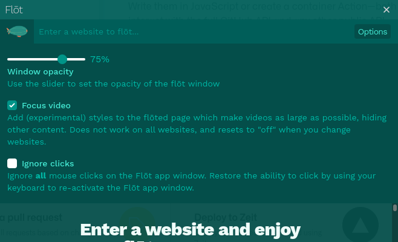

<h1 align="center">
   
  
   
  Flōt (fl<i>oh</i>t)
   
   
</h1>

<h4 align="center">Keep a website always-on-top and translucent. For Mac, Windows, and Linux.</h4>

  
  
  

## Install

Download the latest version of Flōt for your operating system from
[the official website](https://flot.page) or from
[GitHub Releases](https://github.com/andrewbrey/flot/releases/latest)

## Important Notes About Usage

1. Flōt embeds a website of your choosing inside of the Flōt application. Some
   websites do not permit being embedded in this way by default, and Flōt
   bypasses this restriction by disabling certain web security mechanisms. This
   should be perfectly safe if you're just using it to view a video or content
   site, but you should exercise caution by not using Flōt as a general purpose
   web browser. Those protections are within your browser are important to
   ensure you don't have private or sensitive information stolen.

> TLDR; Flōt is mostly a fun toy, and should not be used like a regular browser.
> Don't do your banking in a Flōt window.

2. In order to distrubute and/or auto-update an app on Windows and Mac,
   developers need to pay pretty large fees to become part of the respective
   developer programs for each platform. Since Flōt is just for fun, to scratch
   my own itch, I have chosen not to pay these fees for the sake of this app.
   This means that this app is **"unsigned"** and is therefore likely to trigger
   warnings from your operating system about being from an "untrusted
   developer". This is expected, and the instructions to get passed this will
   vary depending on your operating system.

   For mac
   [here is a support page to install an untrusted dmg
   file](https://support.apple.com/guide/mac-help/open-a-mac-app-from-an-unidentified-developer-mh40616/mac)

   On Windows, you should just be able to use the presented prompt to open the
   app

   While I promise this app does nothing malicious, please don't just take my
   word for it! The code is here for you to see and read :)

> TLDR; Flōt may be flagged by your computer as an app you shouldn't open. You
> can bypass this if you understand the risks. Note that for Mac, this will
> prevent the app from auto-updating itself, so updates must be installed
> manually.

## Features

Top feature: It's simple and works like a charm ❤️

- Adjustable transparency to ensure just the right level of visibility
- Stays on top of other windows and out of your way
- Optional "detached" mode which will let mouse clicks "pass through" Flōt to
  the window below
- Simple and clean design with just the cutest little logo drawn by my wife

# Screenshots

|                                                   |                                                              |
| :-----------------------------------------------: | :----------------------------------------------------------: |
|  |  |

|                                                              |                                                                |
| :----------------------------------------------------------: | :------------------------------------------------------------: |
|  |  |

|                                                           |
| :-------------------------------------------------------: |
|  |

## License

[MIT](./LICENSE). Copyright (c) [Andrew Brey](https://andrewbrey.com)
